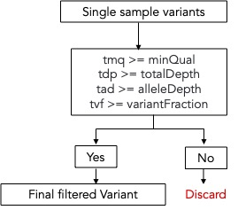

# Vardict

This hosts multiple scripts necessary for filtering and processing variant calls in the vcfs/txt file generated by callers.

## Callers Supported

`pv` is the main command for the `postprocessing_variant_calls` package see `pv --help` to see supported variant callers commands.

### Vardict

The sub-command `pv vardict` allows users to perform post-processing on VarDictJava output. The two supported inputs to `pv vardict` from VarDictJava are `single` and `case-control` vcfs.

To specify to `pv vardict`, which input type will be used one of the following sub-commands may be used:

* `pv vardict single` for single sample vcfs
* `pv vardict case-control` for case-controlled vcfs.

Next the user can specify, what post-processing should be done. Right now, `postprocessing_variant_calls` supports filtering:

* `pv vardict single filter`
* `pv vardict case-control filter`

Finally, we can specify the paths and options for our filtering and run our command. Here is an example using the test data provided in this repository:

`pv vardict single filter --inputVcf data/Myeloid200-1.vcf --tsampleName Myeloid200-1 -ad 1 -o data/single`

There are various options and input specifications for filtering so see `pv vardict single filter --help` or `pv vardict single case-sontrol --help` for help.

See `example_calls.sh` for more example calls.

## How the repo was made

Template used: https://github.com/yxtay/python-project-template

### Usage

#### External dependencies

* \[Conda]\[conda]
* \[Docker]\[docker]
* \[Make]\[make]

#### Create environment

Use Conda to create a virtual environment and activate it for the project.

```bash
conda env create -f environment.yml
conda activate pv_calls
```

#### Install dependencies

Then install project dependencies with Poetry.

```bash
make deps-install
```

#### Updating Environment

To update the environment after initial setup up run:

```bash
conda env update -f environment.yml
```

instead of `conda create`, and then re-run `make deps-install`

### **Visual representation of how this module works:**

Leveraging the PyVcf package the following filtering is performed:

Case 1: Single sample mode

<figure><figcaption></figcaption></figure>

Case 2: Case-control mode

<figure><figcaption></figcaption></figure>

Abbreviations

* TVF - Tumor Variant Fraction
* NVF - Normal Variant Fraction
* tmq - tumor minimum quality
* nmq - normal minimum quality
* tdp - total depth&#x20;
* tad - total allele depth
